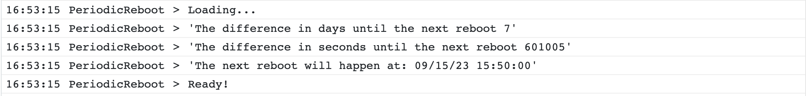

# Periodic Reboot for Webex Devices

This macro schedules a weekly reboot of a device at a specified day and time each week.

The primary xAPI Command used is: [Reboot](https://roomos.cisco.com/xapi/Command.SystemUnit.Boot)

## Contacts
* Trevor Maco

## Solution Components
* Webex Devices
* xAPI
* Javascript

## Requirements
* Devices must be running RoomOS 9 or later (see Reboot documentation for all supported configurations like MTR)
* Supported Devices: Room, Board, Desk Series

## Prerequisites
Ensure Macros are configured and enabled on the device. Macros can be configured and deployed from Control Hub or the device's local webpage. Follow this [guide](https://help.webex.com/en-us/article/gj962f/Configure-macros-and-user-interface-extensions-for-Board,-Desk,-and-Room-Series) to get started.

Ensure the `AutoStart` and `Mode` Macro Configuration Settings are both set to on.

## Installation/Configuration
1. Load the Javascript code included in the `PeriodicReboot.js` file in this repository into a new Macro in the Macro editor of the Cisco Webex device you wish to use.
2. Before activating the macro, set the following constants in the code on your device. 
* `RebootTime`: represents the time in HH:MM (24-hour format) to reboot the device
* `RebootDay`: represents the day of the week to reboot the device. Please use the corresponding number mapped to the day of the week.
```
// By default, reboot every Sunday at 10:00 AM
const RebootTime = "10:00" // time to reboot (24 h)
const RebootDay = "0" // Sunday: 0, Monday: 1, Tuesday: 2, Wednesday: 3, Thursday: 4, Friday: 5, Saturday: 6
```
3. Activate the macro

> If you are unfamiliar with Cisco Room device macros, [this](https://help.webex.com/en-us/np8b6m6/Use-of-Macros-with-Room-and-Desk-Devices-and-Webex-Boards) is a good article to get started.

> For some sample code to show you how to automate the deployment of this macro, wallpapers, touch 10 UI controls and others to multiple Webex devices, you can visit [this repository](https://github.com/voipnorm/CE-Deploy)

> For information on deploying the macros, you can read the [Awesome xAPI GitHub repository](https://github.com/CiscoDevNet/awesome-xapi#user-content-developer-tools). In addition to the deployment information, this repository also has tutorials for different macro uses, articles dedicated to different macro capabilities, libraries to help interacting with codecs, code samples illustrating the xAPI capabilities, and sandbox and testing resources for macro applications.


## Usage
The macro will now run in the background.

The macro will log in the console output and macro logs the time until the next reboot:



The time until the next reboot will also be displayed on screen once calculated:


At 10 minutes until the reboot, a warning message will be displayed on screen:


# Screenshots


### LICENSE

Provided under Cisco Sample Code License, for details see [LICENSE](LICENSE.md)

### CODE_OF_CONDUCT

Our code of conduct is available [here](CODE_OF_CONDUCT.md)

### CONTRIBUTING

See our contributing guidelines [here](CONTRIBUTING.md)

#### DISCLAIMER:
<b>Please note:</b> This script is meant for demo purposes only. All tools/ scripts in this repo are released for use "AS IS" without any warranties of any kind, including, but not limited to their installation, use, or performance. Any use of these scripts and tools is at your own risk. There is no guarantee that they have been through thorough testing in a comparable environment and we are not responsible for any damage or data loss incurred with their use.
You are responsible for reviewing and testing any scripts you run thoroughly before use in any non-testing environment.